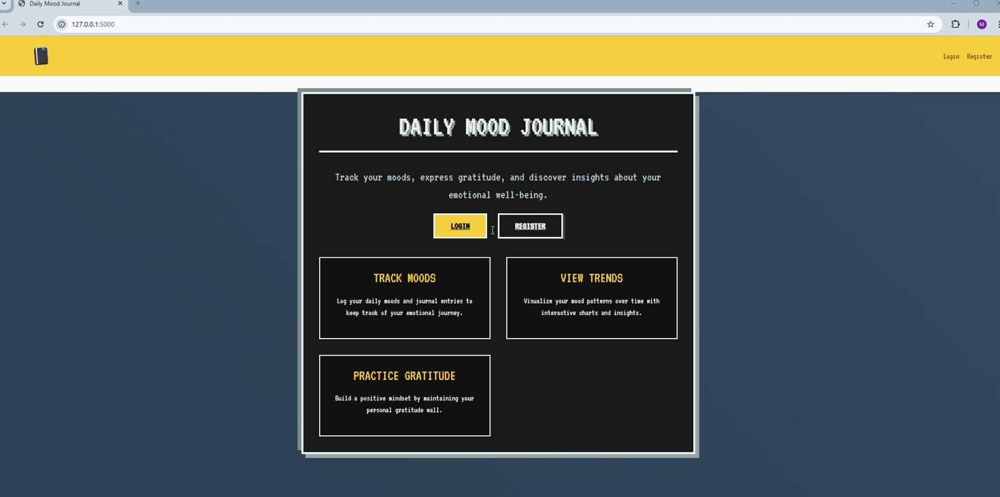
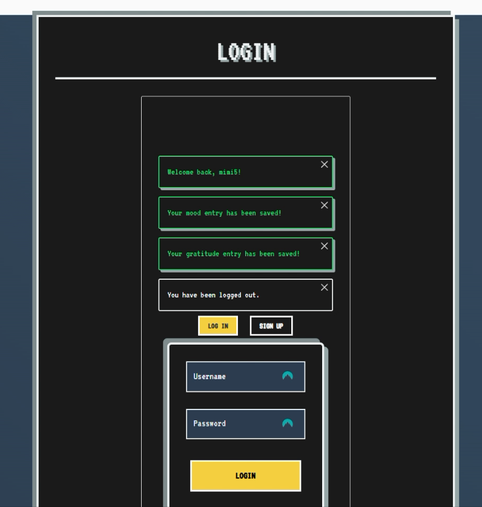
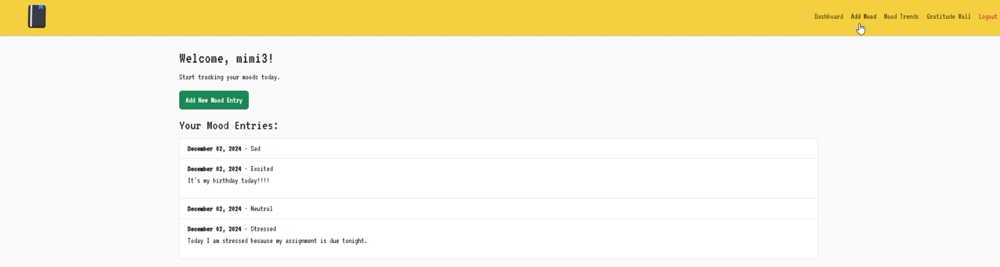
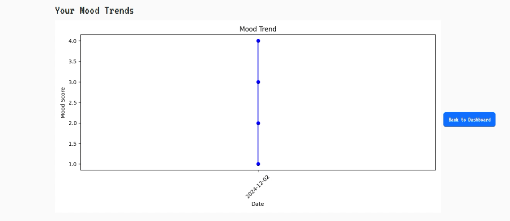
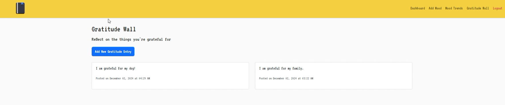

# Daily Mood Journal

Daily Mood Journal is a full-stack Flask web application that helps users track their moods, write journal entries, record moments of gratitude, and review mood trends over time.

## Features

- **User authentication:** Register, log in, and log out with password hashing and Flask-Login.
- **Mood tracking:** Record a daily mood with an optional journal entry.
- **Mood visualizations:** View mood history as a Matplotlib line chart.
- **Gratitude wall:** Save and review personal gratitude entries.
- **Responsive design:** Use the application on desktop and mobile devices.
- **Interactive interface:** Includes character counters, form validation, hover effects, and automatically dismissed messages.

## Screenshots

### Homepage



### Login Page



### Mood Entry



### Mood Trends



### Gratitude Wall



## Technologies

- **Backend:** Python, Flask, Flask-SQLAlchemy, Flask-Login
- **Frontend:** HTML, CSS, JavaScript, Bootstrap
- **Database:** SQLite
- **Visualization:** Matplotlib

## Project Structure

```text
daily-mood-journal/
├── static/
│   ├── app.js
│   └── styles.css
├── templates/
│   ├── add_gratitude.html
│   ├── add_mood.html
│   ├── base.html
│   ├── dashboard.html
│   ├── gratitude_wall.html
│   ├── index.html
│   ├── login.html
│   ├── mood_trends.html
│   └── register.html
├── app.py
├── README.md
└── requirements.txt
```

The application creates `data/database.db` locally when it runs. The database is excluded from the repository to protect user data.

## Getting Started

### 1. Create a virtual environment

```bash
python -m venv .venv
```

Activate it on Windows:

```powershell
.venv\Scripts\activate
```

Activate it on macOS or Linux:

```bash
source .venv/bin/activate
```

### 2. Install the dependencies

```bash
python -m pip install -r requirements.txt
```

### 3. Run the application

```bash
python app.py
```


## Implementation Highlights

- Uses SQLAlchemy models to connect users with their mood and gratitude entries.
- Stores passwords as hashes rather than plain text.
- Converts categorical moods into numerical scores for trend visualization.
- Uses authenticated routes so each user can access only their own entries.
- Provides custom responsive styling and interactive JavaScript behavior.
